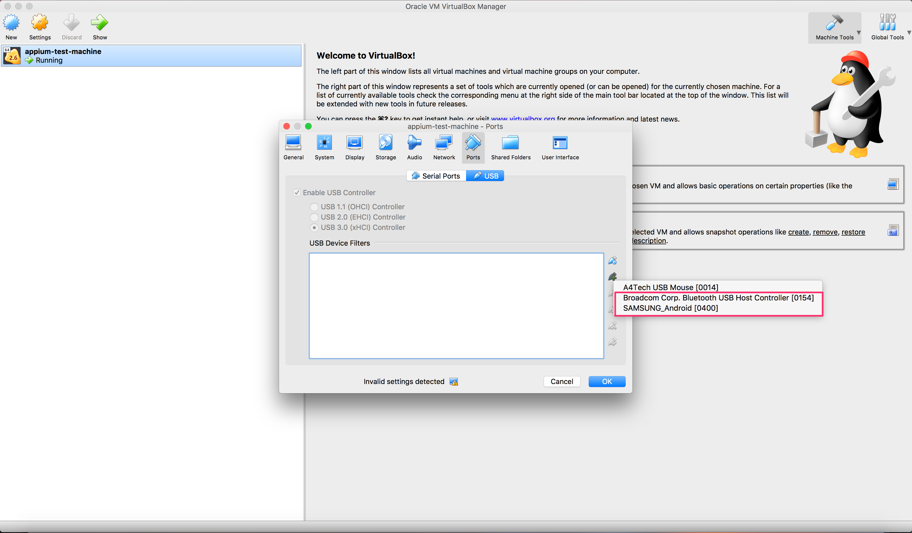

## Docker Setup for Mac
Dockerize container to execute edx-app-test on Android Phone from Mac Host

## Setup

1 - Install followings,

   - [Homebrew](https://docs.brew.sh/Installation)
    
   - [VirtualBox](https://www.virtualbox.org/wiki/Downloads), please don't forget to install Extension Pack
    
   - [docker](https://www.docker.com/community-edition#/download)
    
   - [docker machine](https://docs.docker.com/machine/install-machine/)
    
   - [python3](https://www.python.org/downloads/)

2 - Install edx Android app on Android Device and connect to Mac(through USB) Host

3 - Check out/download project source code,

        git clone https://github.com/edx/edx-app-test

4 - Browse project directory and open `mac-setup.sh` through some editor

   - Enter connected Android Device OS Version against `ANDROID_PLATFORM_VERSION`

   - Enter docker-machine name in place of `<machine name>` in followings i.e appium-machine,

         - docker-machine create --driver virtualbox <machine name>

         - docker-machine stop <machine name>

         - vboxmanage modifyvm <machine name> --usb on --usbehci on

         - docker-machine start <machine name>

   and save changes made. Please note that one may need to enter new machine name on re-running script

   - Permit `chmod +x ./mac-setup.sh`, run `./mac-setup.sh` in terminal and wait for some installations & settings to finish 

5 - Load Virtual box, add USB Controller and connected Android Device as follow,

   - Virtual Box - select specific running docker machine, and load its Settings
   - On Settings dialog select Ports, then USB Tab
   - Click on Add icon under USB Device Filters, select 'USB Host Controller' and connected 'Android Device'. Click on OK and to save settings
   
   

6 - Connect to specific running docker machine, don't forget to add docker-machine name in place of `<machine name>`

          docker-machine ssh <machine name>

7 - From docker machine interface match filesystem to local filesystem of host

8 - Browser to specific downloaded/checked out edx-app-test directory, and run following command to create docker image,  enter docker image name in place of `<machine name>` i.e appium-image

        docker build -t <image name> .

   wait for docker image creation to finish

9 - Run above created docker image, enter container name against `--name` i.e `appium-container` and docker image name
    in place of `<machine name>` as created above

        docker run -it --privileged --rm -d -p 4723:4723  -v /dev/bus/usb:/dev/bus/usb --name <container name> <image name>

   it should return new running container id

10 - Run below command and connected android device should be visible under `List of devices attached` if everything
    was successful

        docker exec -it $(docker ps -q) adb devices

One may need to re-plug the connected Android Device

11 - Open another tab of terminal(on Mac host) and get the ip of specific running docker machine, don't forget
    to enter above created docker machine name in place of `<machine name>`

        docker-machine ip <machine name>

12 - Pass the above machine ip as server url like below 

        export SERVER_URL='http://192.168.99.100:4723/wd/hub'

   its all set to start execution now

## Run

From host machine(Mac) browse project directory, and run any of the followings based on your need,

 - Execute all test cases in specific directory

        pytest

- Execute specific test case

        pytest -v <test case name>

- Execute specific test case with html report at end

        pytest -v <test case name> --html=report.html

- Stop running docker machine, don't forget to enter specific machine name in place of `<machine name>`

        docker-machine stop <machine name>

## Execution Next time
After above successful setup one need to follow below steps only for executions next time,

1 - Connect Android Device to Mac host machine

2- Start and connect to docker machine, don't forget to add docker-machine name in place of `<machine name>`

        docker-machine start <machine name>

        docker-machine ssh <machine name>

3 - Repeat step # 9, 10, 11 & 12

4 - Execute test cases as mentioned in Run section
